# 📝 Action Board Tracker

A modern, stylish, emoji-enhanced desktop task manager built using **Qt6 and C++**. Designed for users who want to track To-Do tasks, Completed items, and Deleted (Recycle Bin) entries with smooth scrollable views, themes, and file persistence.
### 💡 Light Theme
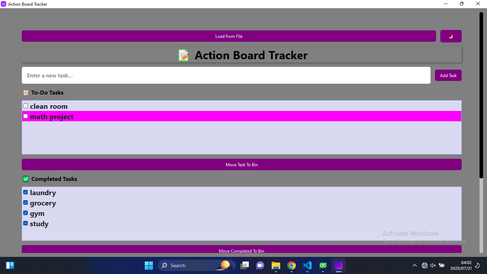

---

## 🚀 Features

✅ Add new tasks with a simple input bar  
✅ Mark tasks as complete with checkbox interaction  
✅ Automatically move tasks between To-Do and Done  
✅ Send tasks to a Recycle Bin for safe deletion  
✅ Restore tasks or permanently delete them  
✅ Save and load tasks to/from `.txt` files  
✅ Light 🌙 / Dark ☀️ theme toggle  
✅ Custom emojis, tooltips, and shadowed UI title  
✅ Scrollable UI and custom scrollbar  
✅ Hover effects, bold fonts, and intuitive layout  

---

## 🖥️ UI Preview

- **To-Do Section** 📋  
- **Completed Tasks** ✅  
- **Recycle Bin** 🗑️  
- **Main Title:** 📝 *Action Board Tracker*

---

## 🎨 Theming

Switch between light and dark modes using the theme toggle button (☀️/🌙). Themes are defined using external `.qss` stylesheets.


    applyTheme(":/light.qss");
    applyTheme(":/dark.qss"); ```


## 📸 Screenshots

### 🪟 Default Window
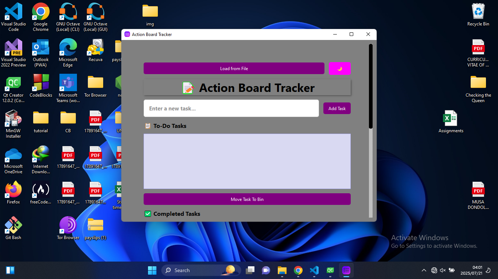
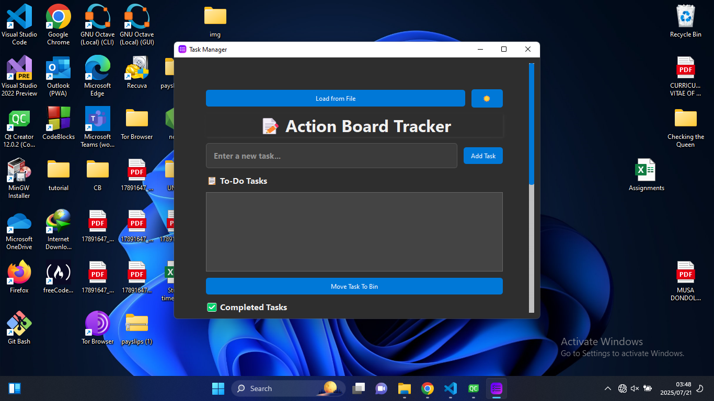

### 📂 Loading File
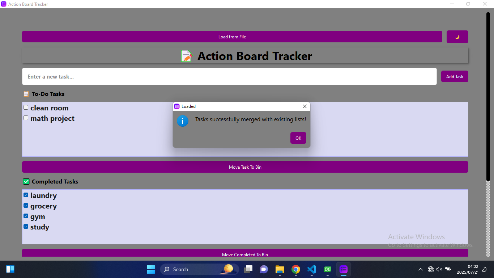
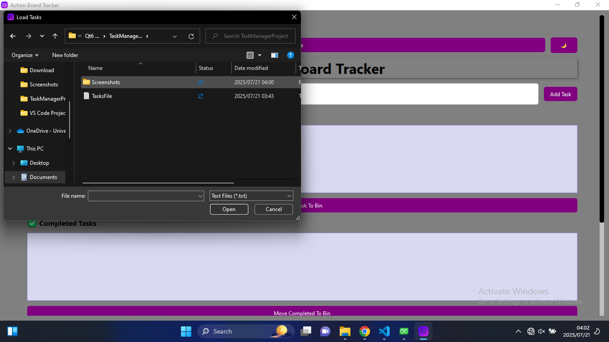


### 🌙 Dark Theme
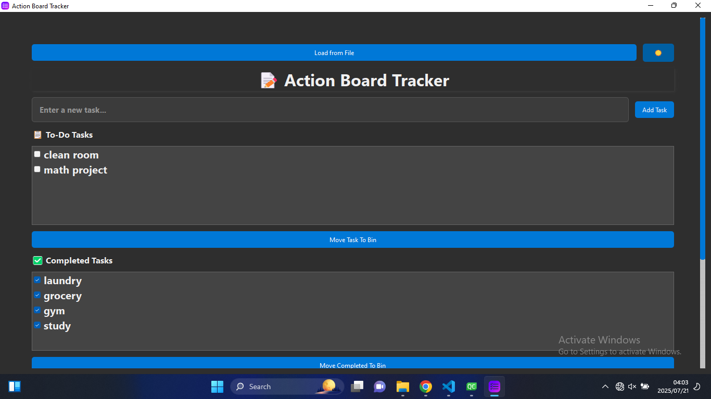

### ➕ Add Task Input
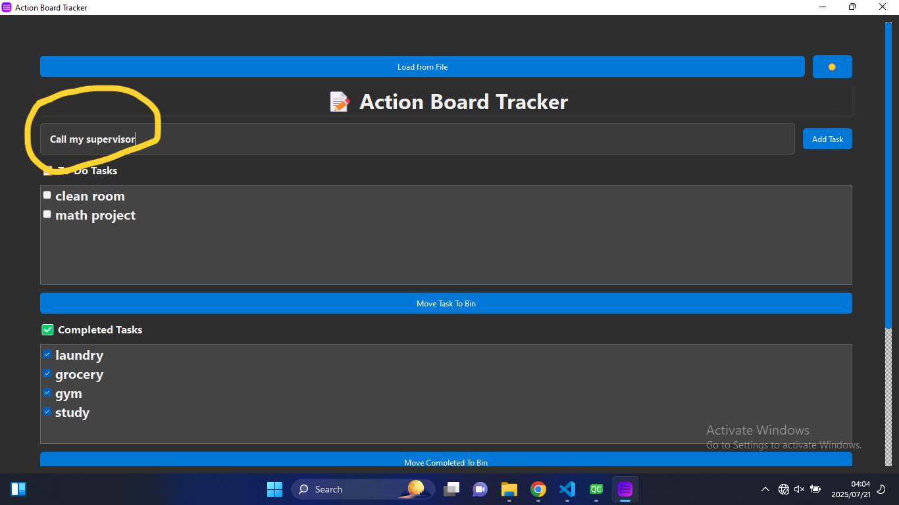

### ✅ Completed Task
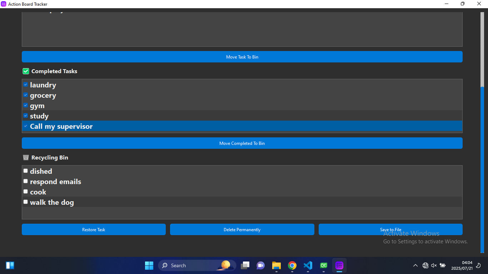

### 🔁 Restore Task
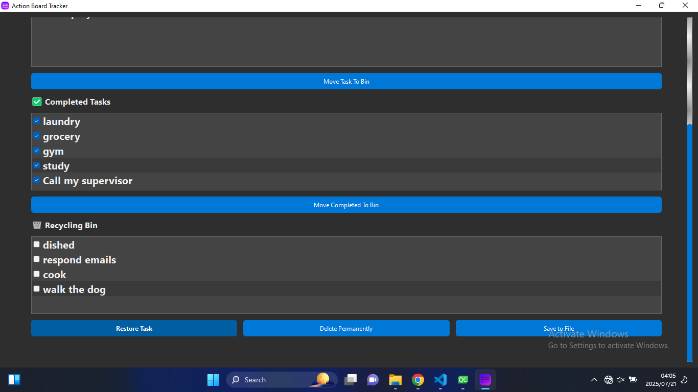

### 📝 App Icon
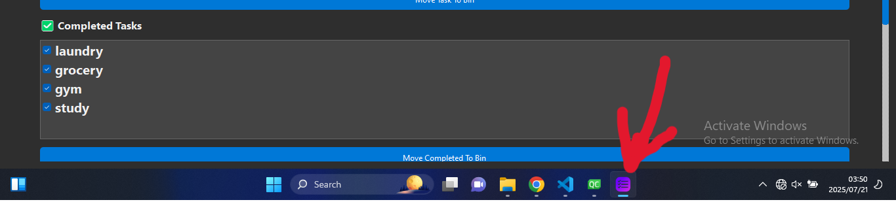

### 💾 File Save
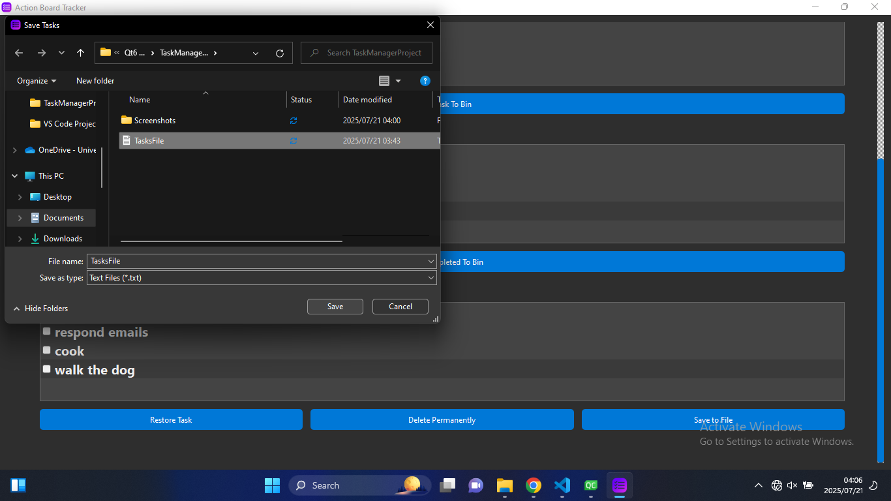
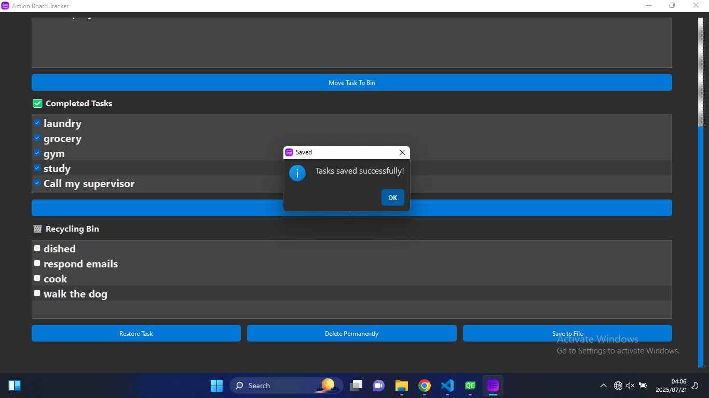


## 💾 Save & Load Format
Text files are organized like so:

text
Copy
Edit
### To-Do Tasks:
- Buy groceries
- Finish report

### Completed Tasks:
- Submit project

### Recycling Bin:
- Old task

## 🧩 Built With
Qt 6 (C++)

> Qt Creator
> Qt Designer / Custom QSS

> Widgets: QListWidget, QPushButton, QLabel, QLineEdit, QScrollArea

> File Handling: QTextStream, QFileDialog

## 🛠️ Build Instructions

    qmake
    make
    ./TaskManagerProject
    
Ensure your .qrc file contains resources like:

    <qresource prefix="/">
        <file>dark.qss</file>
        <file>light.qss</file>
        <file>list.png</file>
    </qresource>

## 📂 File Structure

    TaskManagerProject/
    ├── widget.h / widget.cpp
    ├── main.cpp
    ├── dark.qss / light.qss
    ├── icons/ (e.g. list.png)
    └── TaskManagerProject.pro

##🙌 Acknowledgements

This project was developed as part of a Qt6 C++ UNISA(University of South Africa) course. Great for beginners exploring widget-based GUI applications with custom styling and user interactivity.

## 📜 License
This project is for portfolio/demo purposes only. Feel free to use or adapt it as inspiration!
